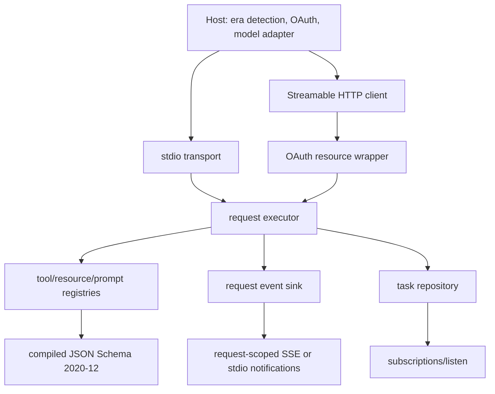

# Complete the MCP Roadmap

## Goal Capsule

- Complete every currently open roadmap issue in `shychee/mcp-from-scratch`: #3-#8 and #16-#24.
- Preserve the from-scratch learning boundary: official SDKs are verification peers only, never production protocol dependencies.
- Ship reviewable commits and dependency-ordered PRs, merge each clean PR, and verify its linked issues close.
- Do not modify CI configuration, persist real credentials, or require external credentials for the clean-checkout smoke path.
- Stop only for an invalid official-spec assumption, unavailable required external fixture with no deterministic local substitute, or a security/product decision beyond the in-memory OAuth boundary.

---

## Product Contract

### Summary

Finish the server and host surfaces required by the repository roadmap, then prove them with local, race-enabled, transport-level, and official-peer interoperability tests. The end state supports modern MCP `2026-07-28`, an isolated legacy stdio compatibility path, richer server features, negotiated extensions, one Tasks flow, protected HTTP, OAuth host discovery with PKCE, progress/cancellation, observability metadata, and a real OpenAI-compatible model adapter boundary.

### Problem Frame

The merged stateless core, MRTR, Streamable HTTP, and tool-list subscriptions provide a sound base, but most server feature surfaces and compatibility/security utilities remain absent. Several old roadmap issues are only partially covered. Closing them without implementation would leave #24's support matrix unsupported by executable evidence.

### Requirements

#### Core server features

- R1. Tool calls support ordered content blocks, `isError`, `structuredContent`, and optional `outputSchema` without conflating tool failures with JSON-RPC errors. (#3)
- R2. The server advertises and implements URI-addressed `resources/list` and `resources/read`. (#4)
- R3. The server advertises and implements argument-rendered `prompts/list` and `prompts/get`. (#5)
- R4. Tool, resource, and prompt list methods support opaque cursors and `nextCursor`; advertised list-change flags match real notification paths. (#6)
- R5. Stdio framing, stdout discipline, version behavior, and lifecycle compatibility have executable coverage; the obsolete modern pre-initialize assumption remains isolated to legacy mode. (#7)
- R6. A real OpenAI-compatible model adapter maps discovered tools into a two-turn tool conversation while tests and smoke runs use a deterministic local fake endpoint. (#8)

#### Compatibility and correctness

- R7. The stdio host detects modern versus legacy peers once per server process, retries recognized modern versions, and falls back to legacy initialization exactly once when appropriate. (#16)
- R8. Tool input and output schemas use a maintained JSON Schema 2020-12 validator, compile before dispatch, return bounded public errors, and reject pathological inputs through documented limits. (#17)
- R9. Client and server extension maps accept `{vendor-prefix}/{name}` identifiers, with reverse-DNS vendor prefixes for third parties, and opaque settings; extensions activate only in the intersection and unknown values remain preserved. (#18)

#### Extensions, authorization, and utilities

- R10. The negotiated `io.modelcontextprotocol/tasks` extension provides one durable in-memory task handle, `tasks/get`, `tasks/update`, `tasks/cancel`, and subscription-delivered task changes without removed task methods. (#19)
- R11. Streamable HTTP can be wrapped as an OAuth resource server with protected-resource metadata, injected token validation, audience/scope enforcement, and standard 401/403 challenges. (#20)
- R12. The HTTP host discovers resource and authorization metadata, performs authorization-code plus PKCE with exact issuer/state/resource validation, uses an in-memory issuer-and-resource-keyed token store, and bounds step-up retries. (#21)
- R13. One bounded slow tool emits ordered request-scoped progress and cooperatively cancels through `context.Context` over stdio and HTTP without cross-request effects or goroutine leaks. (#22)
- R14. W3C trace context and request log level reach tool execution through metadata; request logs stay on the originating stream and redact arguments, authorization, tokens, and opaque request state. (#23)

#### Interoperability and documentation

- R15. Black-box tests prove official client-to-server and host-to-official-fixture flows where the official tooling supports the target revision, with deterministic local contract fixtures for unavailable revision-specific peers. (#24)
- R16. English and Chinese support matrices list core protocol, transports, server features, utilities, extensions, authorization, compatibility, evidence, and known limits consistently. (#24)
- R17. A clean-checkout smoke command builds all binaries and runs credential-free local and interoperability demos. (#24)

### Acceptance Examples

- AE1. Given a dual-era stdio server, when the host's modern probe succeeds, then no initialize request is sent and all later requests remain modern.
- AE2. Given a legacy-only stdio server, when the modern probe receives a non-modern response, then one initialize/initialized sequence runs and the detected era is reused.
- AE3. Given a schema using nested arrays, composition, local `$ref`, and `additionalProperties: false`, valid input reaches the tool and invalid input returns `-32602` without invocation.
- AE4. Given concurrent slow calls, cancelling one request stops only that tool, emits one deterministic terminal response, and leaves the other request and catalog subscriptions alive.
- AE5. Given a token for another resource or missing operation scopes, the HTTP endpoint returns the correct challenge and never dispatches MCP business logic.
- AE6. Given an OAuth response with an issuer or state mismatch, the host never sends the authorization code to a token endpoint.
- AE7. Given an unshared extension, the request completes with core behavior; given a shared Tasks extension, the host can update and observe a task through the subscription channel.
- AE8. Given a clean checkout with no credentials, the smoke target builds binaries, runs local demos, and produces a support-matrix verification result.

### Scope Boundaries

- Production MCP code remains SDK-free.
- OAuth authorization server behavior is represented by an injected fake in tests; this repository is only a resource server and client host.
- Token persistence is deliberately out of scope. The implementation uses an in-memory store; any persistent backend requires later explicit approval.
- CI configuration is out of scope and must not be added or changed.
- The model adapter supports the OpenAI-compatible HTTP contract but the default smoke path uses a local fake model server and no real secret.

### Assumptions

- The issue bodies and MCP `2026-07-28` official schema are authoritative when older roadmap wording references initialization.
- JSON-RPC request IDs support both string and integer values before cancellation, subscriptions, Tasks, and interoperability build on that shared identity type.
- A maintained Go JSON Schema library is acceptable as a correctness dependency because the issue explicitly requires a standards implementation; MCP protocol behavior itself remains handwritten.

---

## Planning Contract

### Key Technical Decisions

- KTD1. Use dependency-ordered PR slices rather than one monolithic PR: core features and compatibility; progress/observability; Tasks; OAuth resource server and host; model adapter and interoperability. Each slice closes only issues whose acceptance tests are present and adds its own interoperability evidence and support-matrix rows.
- KTD2. Make request execution explicit with `context.Context` and a request event sink shared by stdio and HTTP. Progress, cancellation, trace propagation, and request logs build on this boundary instead of transport-specific side channels.
- KTD3. Keep legacy lifecycle state inside one stdio connection. The modern `Server.Handle` remains stateless and never requires prior discovery.
- KTD4. Compile JSON Schema validators at tool registration and cache registry definitions by name. Runtime validation uses bounded input size/depth and returns stable `Invalid Params` messages without leaking library internals.
- KTD5. Model extensions as opaque namespaced JSON objects in protocol metadata. Core code validates `{vendor-prefix}/{name}` identifier shape, computes the intersection, and does not interpret unknown settings.
- KTD6. Put Tasks persistence behind a narrow repository interface. The first repository is concurrency-safe in-memory storage and documents the production durability boundary. A transport-derived principal in the shared execution context owns every task; unauthenticated stdio and HTTP use connection-scoped anonymous principals, authenticated HTTP uses the validated token subject, and ownership is enforced on get, update, cancel, and task-change delivery.
- KTD7. Wrap the existing HTTP handler with OAuth authorization. Token validation is injected; MCP dispatch never receives or forwards raw bearer tokens. An explicit default-deny policy maps MCP method and optional `Mcp-Name` to required scopes and supplies the challenge scope for 403 responses.
- KTD8. Keep OAuth host browser/redirect work behind an authorization-code provider callback and use an issuer-and-resource-keyed memory store. Pending authorization transactions are single-use, expire, and atomically bind state, issuer, resource, and PKCE verifier. Discovery and token endpoints require HTTPS except explicit loopback tests, reject userinfo/fragments and disallowed private/link-local destinations, and revalidate redirects. This satisfies the safe test/demo path without choosing persistent credential storage.
- KTD9. Add a provider-neutral model adapter interface and one OpenAI-compatible HTTP implementation. Integration tests use a local server that exercises the actual wire contract.
- KTD10. Use official SDK/Inspector packages only in test or command fixtures. If the official peer does not yet expose the `2026-07-28` revision, record the limitation and retain deterministic black-box wire fixtures instead of weakening the production revision.

### High-Level Technical Design

### Sequencing

1. Establish public registry/result types, resources, prompts, pagination, schema compilation, extensions, and dual-era stdio compatibility.
2. Add shared request execution context, progress/cancellation, then trace/log propagation.
3. Add Tasks on the extension and subscription foundations.
4. Add OAuth resource protection, then host discovery/PKCE.
5. Add the real model adapter, official-peer interoperability harness, support matrices, and clean smoke target.

### Risks and Mitigations

- Official tooling may lag the target revision. Pin exact test-tool versions, distinguish official evidence from local fixtures, and publish partial support honestly.
- Stdio concurrency can interleave JSON. Keep one synchronized encoder and track in-flight request cancellation by ID.
- OAuth mix-up and audience confusion are security-critical. Validate issuer, state, resource, audience, expiry, and scope before replay or dispatch.
- A schema library can expose unbounded reference behavior. Reject remote references, cap input bytes and nesting, compile on registration, and test local references/composition.
- Broad issue scope can hide regressions. Keep commits and PRs aligned to dependency slices and run normal plus race tests for every slice.

---

## Implementation Units

| Unit | Title | Primary files | Depends on |
|---|---|---|---|
| U1 | Public registries, request IDs, and rich results | `internal/mcpserver/server.go`, `internal/protocol/types.go` | - |
| U2 | Resources, prompts, pagination | `internal/mcpserver/catalogs.go`, `internal/mcpserver/subscriptions.go` | U1 |
| U3 | JSON Schema 2020-12 | `internal/mcpserver/schema.go`, `go.mod` | U1 |
| U4 | Dual-era stdio compatibility | `internal/mcpserver/stdio.go`, `internal/host/compatibility.go` | U1 |
| U5 | Extension negotiation | `internal/protocol/extensions.go`, `internal/host/extensions.go` | U1 |
| U6 | Request execution, progress, cancellation | `internal/mcpserver/execution.go`, transport files | U1 |
| U7 | Tasks extension | `internal/mcpserver/tasks.go`, `internal/host/tasks.go` | U2, U5 |
| U8 | OAuth resource server | `internal/mcpserver/oauth.go` | U1 |
| U9 | OAuth host and PKCE | `internal/host/oauth.go` | U8 |
| U10 | Trace context and request logs | `internal/mcpserver/observability.go` | U6 |
| U11 | OpenAI-compatible model adapter | `internal/host/model.go`, `cmd/mcp-model-demo` | U1, U2 |
| U12 | Final interoperability and support matrix | `internal/interop`, `docs/support-matrix.md`, docs and Makefile | U2-U11 |

### U1. Public registries and rich results

- **Requirements:** R1.
- **Files:** `internal/mcpserver/server.go`, `internal/protocol/types.go`, `internal/mcpserver/server_test.go`.
- **Approach:** Introduce a comparable string-or-integer request-ID type; export usable tool definitions/invocations/results; preserve ordered content; separate tool failure fields from protocol errors; and index registry entries by name. `RegisterTool(Tool) error` compiles schemas before atomically publishing an entry, rejects nil/duplicate/invalid definitions, and `New` fails fast only for its known built-ins. Structured output is validated before serialization; an implementation-produced output mismatch is an internal JSON-RPC error and no invalid tool result is emitted.
- **Test scenarios:** String and integer IDs; multiple ordered blocks; structured output; `isError`; optional output schema; invalid output rejected as an internal error; duplicate, nil, and invalid registration; unchanged echo/MRTR flows.
- **Verification:** `go test ./internal/mcpserver -run 'Rich|Tool|MRTR' -count=1`.

### U2. Resources, prompts, pagination, and list changes

- **Requirements:** R2, R3, R4.
- **Files:** `internal/mcpserver/catalogs.go`, `internal/mcpserver/subscriptions.go`, `internal/host/demo.go`, corresponding tests.
- **Approach:** Add concurrency-safe registries, sorted snapshots, opaque offset cursors, modern cacheable list results, URI/name reads, prompt rendering, and filter-specific change broadcasts.
- **Test scenarios:** First/next/terminal pages, malformed cursor, resource URI read, prompt argument rendering, accurate capabilities, opt-in event routing.
- **Verification:** focused catalog/subscription tests plus all demos.

### U3. JSON Schema 2020-12 validation

- **Requirements:** R8.
- **Files:** `internal/mcpserver/schema.go`, `internal/mcpserver/server.go`, `go.mod`, tests and docs.
- **Approach:** Select a maintained library with draft 2020-12 support; compile input and output validators at registration; disallow remote reference retrieval; bound payload size and nesting; normalize client input failures as `-32602`; and map server-produced output violations to a bounded internal JSON-RPC error without emitting the invalid result.
- **Test scenarios:** object/number/boolean/array/nested/additionalProperties/composition/local `$ref`, invalid schema, oversized/deep input, no-dispatch on input violation, no invalid result emitted on output violation.
- **Verification:** focused schema tests, `go test ./...`, `go vet ./...`.

### U4. Dual-era stdio compatibility and hardening

- **Requirements:** R5, R7.
- **Files:** `internal/mcpserver/stdio.go`, `internal/host/compatibility.go`, command flags, tests and roadmap docs.
- **Approach:** Add a per-connection era state machine, modern probe classifier/version retry, single legacy fallback, isolated initialize/initialized lifecycle, modern-only diagnostic, NDJSON/stdout tests. A successful discover selects modern; `-32022` retries only a server-advertised supported version; `-32601` for `server/discover` or a valid legacy initialize-shaped response selects legacy once; malformed JSON, EOF, transport failures, auth failures, and unrelated JSON-RPC errors fail without downgrade.
- **Test scenarios:** Modern success, supported-version retry, legacy method-not-found fallback, valid legacy-shaped fallback, malformed/EOF/transport/server-error no-fallback; the five client/server acceptance combinations; pre-initialize legacy rejection; modern stateless direct request; no duplicate fallback; stderr/stdout separation.
- **Verification:** focused subprocess matrix, modern demo, legacy demo, race tests.

### U5. Extension negotiation

- **Requirements:** R9.
- **Files:** `internal/protocol/extensions.go`, discovery/result metadata, host tests.
- **Approach:** Validate reverse-DNS identifiers, preserve opaque settings, advertise server extensions, and compute a per-interaction intersection.
- **Test scenarios:** shared/client-only/server-only/malformed/unknown settings and core fallback.
- **Verification:** protocol and host unit tests plus default demo.

### U6. Request execution, progress, and cancellation

- **Requirements:** R13.
- **Files:** `internal/mcpserver/execution.go`, `stdio.go`, `http.go`, host transports, tests and slow demo tool.
- **Approach:** Track in-flight requests by ID, run tool calls with contexts, expose a bounded event sink, route notifications on the originating transport stream, and make cancel idempotent.
- **Test scenarios:** ordered progress, cancel before/during/after/unknown, concurrent isolation, HTTP disconnect, no subscription leakage, goroutine completion.
- **Verification:** focused tests and `go test -race ./... -count=1`.

### U7. Tasks extension

- **Requirements:** R10.
- **Files:** `internal/mcpserver/tasks.go`, `internal/host/tasks.go`, subscriptions and demo command.
- **Approach:** Add a repository-backed task state machine, negotiated tool handle result, `tasks/get`, `tasks/update`, `tasks/cancel`, expiry and execution-context principal checks, and principal-filtered tagged task-change subscription events. Ordinary request cancellation remains separate from task cancellation. HTTP `tasks/get`, `tasks/update`, and `tasks/cancel` mirror `taskId` in `Mcp-Name`.
- **Test scenarios:** negotiation gate, create/get/update/cancel/complete, unknown/expired/completed/cross-principal handles over HTTP and stdio, notification order and ownership filtering, removed methods rejected.
- **Verification:** task tests, task demo, race suite.

### U8. OAuth resource server

- **Requirements:** R11.
- **Files:** `internal/mcpserver/oauth.go`, HTTP tests.
- **Approach:** Publish RFC 9728 metadata and wrap MCP dispatch with injected bearer validation; require issuer/resource/audience/expiry/scopes before dispatch; and apply an explicit default-deny method/name scope policy.
- **Test scenarios:** valid, missing/malformed/expired token, wrong issuer/audience, distinct operation scopes, missing scope, query token ignored, redaction/non-forwarding, exact 401/403 challenges.
- **Verification:** focused `httptest` suite and full race suite.

### U9. OAuth host discovery and PKCE

- **Requirements:** R12.
- **Files:** `internal/host/oauth.go`, HTTP client integration and fake authorization server tests.
- **Approach:** Discover protected-resource and authorization metadata, prefer Client ID Metadata Documents, support bounded DCR fallback, generate S256 PKCE/state, atomically consume an expiring pending transaction before exchange, validate issuer/state/resource, store tokens in memory by issuer and resource, and replay once after authorization. Apply the outbound endpoint policy from KTD8 to every discovery, registration, token, and redirect target.
- **Test scenarios:** success, issuer mix-up, missing issuer, state mismatch/replay/expiry, concurrent flows, PKCE failure, wrong audience, insufficient-scope step-up, bounded retries, correct application type, HTTPS downgrade, userinfo/fragment, private/link-local target, and redirect revalidation.
- **Verification:** local end-to-end fake issuer tests; no filesystem credential writes.

### U10. Trace context and request-scoped logging

- **Requirements:** R14.
- **Files:** `internal/mcpserver/observability.go`, execution and transport tests.
- **Approach:** Parse or ignore malformed W3C fields under a documented policy, place validated values in context, gate log events on request metadata, redact sensitive fields, and keep stdio diagnostics on stderr.
- **Test scenarios:** propagation, malformed metadata, no auth use, log-level gate, SSE/stdio routing, redaction, `logging/setLevel` rejection, stdout discipline.
- **Verification:** focused tests, demo, race suite.

### U11. OpenAI-compatible model adapter

- **Requirements:** R6.
- **Files:** `internal/host/model.go`, model demo command, tests and docs.
- **Approach:** Define a small adapter interface and implement OpenAI-compatible chat/tool request-response mapping with injected endpoint/client/token; feed the MCP tool result into the follow-up model turn.
- **Test scenarios:** no tool call, one tool call, malformed model arguments, MCP tool error, second-turn answer, Authorization header redaction; local fake endpoint only.
- **Verification:** adapter integration test and credential-free demo.

### U12. Interoperability, docs, and clean smoke

- **Requirements:** R15, R16, R17.
- **Files:** `internal/interop`, optional test-only fixtures, `docs/support-matrix.md`, `docs/support-matrix.zh.md`, both READMEs, roadmap, Makefile.
- **Approach:** Pin official verification peers outside production code, consolidate the per-slice black-box evidence already added with U1-U11, add final bidirectional and negative cases, publish evidence-backed matrices, and expose one clean smoke target. Core stdio/HTTP interoperability lands with U2-U5; each later unit updates its own matrix rows instead of deferring all compatibility feedback to U12.
- **Test scenarios:** official client to stdio/HTTP server, host to official fixture modern/legacy, negative version/metadata/header/params/result/status cases, feature-matrix evidence consistency.
- **Verification:** `make smoke`, normal/race tests, vet, bilingual matrix parity check.

---

## Verification Contract

| Gate | Command | Done signal |
|---|---|---|
| Formatting | `gofmt -w <changed-go-files>` | No formatting diff |
| Unit and integration | `GOCACHE=/tmp/mcp-from-scratch-go-cache go test ./... -count=1` | All packages pass |
| Concurrency | `GOCACHE=/tmp/mcp-from-scratch-go-cache go test -race ./... -count=1` | No failures or race reports |
| Static checks | `GOCACHE=/tmp/mcp-from-scratch-go-cache go vet ./...` | Exit 0 |
| Existing demos | `make demo && make demo-http && make demo-subscriptions` | All exit 0 |
| New feature demos | `make demo-legacy && make demo-tasks && make demo-oauth && make demo-progress && make demo-model` | All exit 0 without credentials |
| Interoperability | `make interop` | Bidirectional and negative matrix passes or records an explicit official-peer limitation |
| Clean smoke | `make smoke` | Builds binaries and runs all credential-free verification |
| Diff hygiene | `git diff --check` | No whitespace errors |

---

## Definition of Done

- Every R-ID is backed by an observable test or documented, evidence-based interoperability limitation.
- Each issue #3-#8 and #16-#24 is linked to a merged PR or closed with an accurate supersession explanation after its remaining acceptance criteria are covered.
- Production protocol code does not import an MCP SDK.
- OAuth tests use fake issuers and in-memory credentials; no secrets or persistent token files exist.
- Normal tests, race tests, vet, demos, interoperability checks, and clean smoke pass from the merged branch.
- English and Chinese capability matrices agree on versions, support status, evidence, and security boundaries.
- No CI configuration changes are included.
- Dead-end experiments, generated credentials, temporary runtime artifacts, and unused abstractions are absent from the final diff; deterministic local fake-server fixtures required by U9 and U11 remain.
